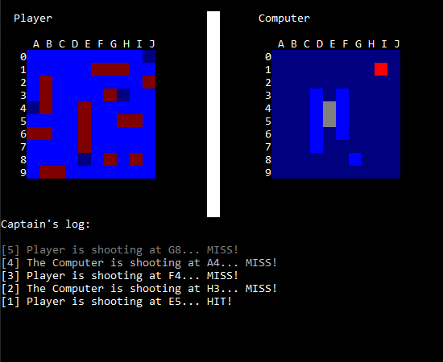

# Battleships game
Written on 12 Jan 2019.

Battleships game with a graphical interface written in C++, using only the basic libraries:
- iostream, 
- random, 
- string, 
- conio.h, 
- Windows.h

Remember to add all files to Visual Studio if you want to make it work.
 

  

